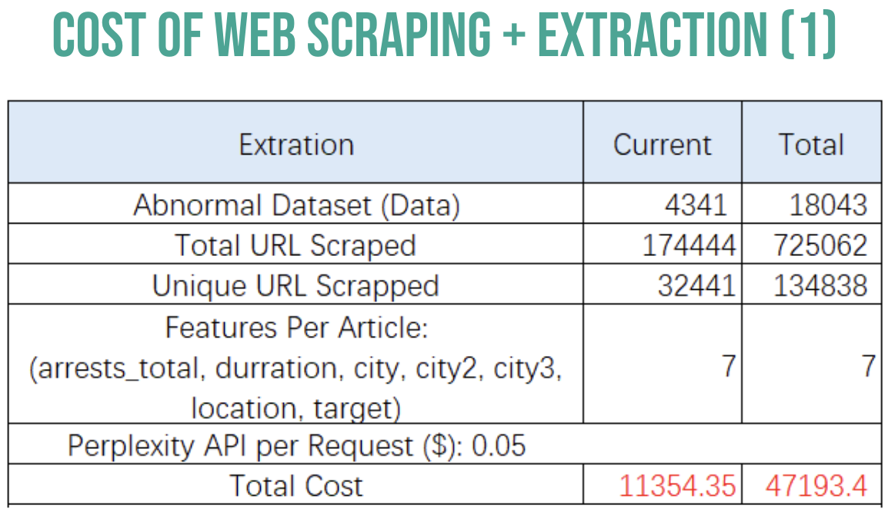

# CISS: Immigration Raids Project

## Project Description
There are two agencies that are responsible for conducting immigration arrests: Border Patrol and Immigration and Customs Enforcement (ICE). Border Patrol only has jurisdiction to conduct arrests within 50 miles of the US border. On the other hand, ICE has all remaining  jurisdiction and this agency is growing. One of their tactics for enforcing immigration within the US are what they call “fugitive operations,” i.e. immigration raids. This is when ICE strategically goes to a specific location-could be a church, factory, trailer park, and more- to arrest at least 1 individual.

In the Obama era, individuals encountered during an immigration raid were not arrested during an investigation unless they have a criminal background or were considered a priority. After Obama, Trump eliminated priority considerations, fundamentally granting ICE officers much more discretion. Now there is no discretion of who may be arrested during an immigration raid, which means someone without a criminal offense can also get arrested for simply being encountered during an operation.

ICE does not have a centralized database for all of this information. Instead, a nonprofit called TRAC is dedicated to compiling the arrest data from FOIA requests to ICE and Border Control. Dr. Tatiana Padilla, a postdoctoral fellow at BU, has reconstructed the TRAC data to show the number of arrests every day to find all the anomalies of large arrest counts. Most of these isolated days of high arrest counts are confirmed immigration raids. 

Dr. Padilla wants to make the immigration raids dataset public to fill this gap to the media and greater public as well as encourage other academic scholars to have access to this data for research purposes. 

## File Directory
See the following document for file pointers.

[CISS: Immigration Raids Documents Pointers - FA24 DS701 Team](https://docs.google.com/document/d/10YAeKU4LWG_L50gqsEnqxnS4E3AdBPxpccDun7r8OVo/edit?tab=t.0#heading=h.1mz9fuyk7986)

## EDA Findings
Please see the following EDA Analysis:

[EDA Analysis PR](https://github.com/BU-Spark/ds-padilla-immigrant-raids/issues/17)

If you want to access the notebooks for EDA, they are under `./EDA`.

## Project Structure
Here is one of the proposed framework we have, using web scraping + online models via API providers to fullfill the whole pipeline.

## Web Scraping
Notes to further Spark! team:
Currently there are a dispute between current Spark! team and the client on refurbishment of web scraping, so please preceed with cautions.
If you would like to know more, check out: 
[bu-spark issues](https://github.com/BU-Spark/bu-spark/issues/88)

Screen shot of the Azure billing:

You have been warned.

## Web Scraping Instructions
Current scraping was done from in the following manner. Source code for scraper could be found at bing_search.ipynb or bing_search_arrest_dataset.py.

    # Dictionary with both query and desired result count
    return {
        'pattern1': {
            'query': f"Immigration raid {county}, {state}",
            'count': 15
        },
        'pattern2': {
            'query': f"ICE arrests {county} {state}",
            'count': 10
        },
        'pattern3': {
            'query': f"Immigration arrest {state}",
            'count': 10
        },
        'pattern4': {
            'query': f"Immigration raid {state}",
            'count': 5
        }
    }
As for Azure, scrapping is done through Bing Search V7 with S2 subscription.

Input of the scraper is `./Datasets/Abnormal Arrest Days, All Days All Counties.xlsx - Sheet1.csv` or whatever name it is given now.
Output of the scraper is the .csv files find under `./Datasets` starting with `search_results`.

## Cost Analysis
Cost Analysis is done through a few ways, majorily for the prediction of the whole workflow for the 

**Cost of Web Scraping**

**Cost of Web Scraping and Extraction**

**Cost of Web Scraping and Extraction**

## Tech Stacks
Quick rundown on our tech stack.

## Analysis

Many of the visualizations could be found on our final presentation
[Final Presentation](https://docs.google.com/presentation/d/1RTk7O5OC5QlWf6Uvua95UNIzubXfu3MgmG69rLbWfbM/edit#slide=id.g2d69ef4e2e1_3_20)
